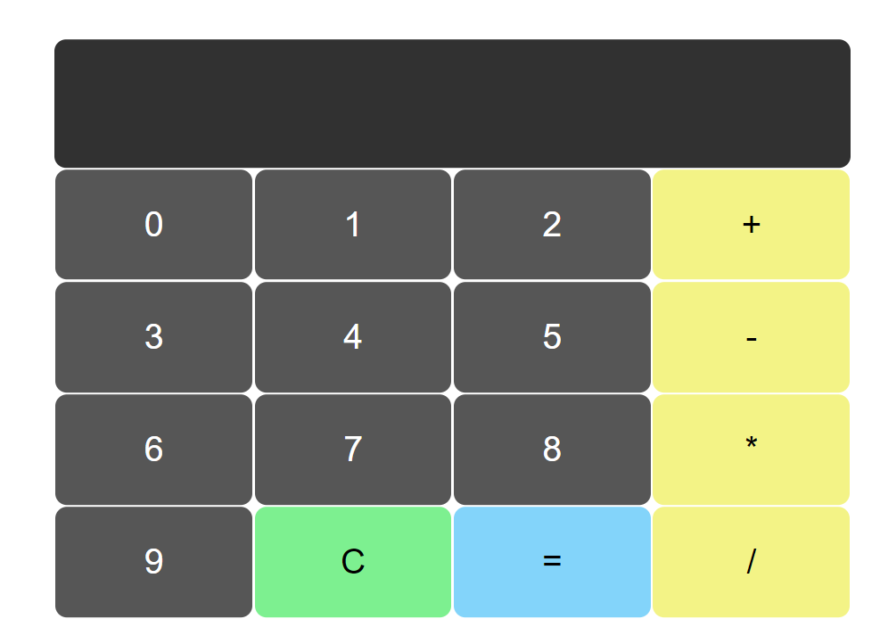

# Calculator

I spent a lot of time referring to different calculator projects for solving one issue. The problem was on clicking Enter, the inputbox would be populated with the digit recently clicked on screen. i.e if you would enter '2+3' and hit 'Enter', the expected output is '6'. The action should evaluate the expression and display the output on screen. But Instead the output would be '2+33'.    
I am a begginner to JavaScript but it took me a while to understand this behavior. All the projects I refferred to had the same issue. On hitting 'Enter' the expression was not getting evaluated.    

### Solution:

I found out that on clicking any button on screen, the focus is shifted to that button. As a result, now when you hit Enter, the last interacted button is selected cause it is still in focus. All you have to do is shift the focus to the input box :)     

### Feature:

1. Used eval() function to evaluate the expressions and display output
2. Exception handling to handle Invalid Expressions entered by user.

Working URL: https://modest-mclean-d66ee4.netlify.app/

     